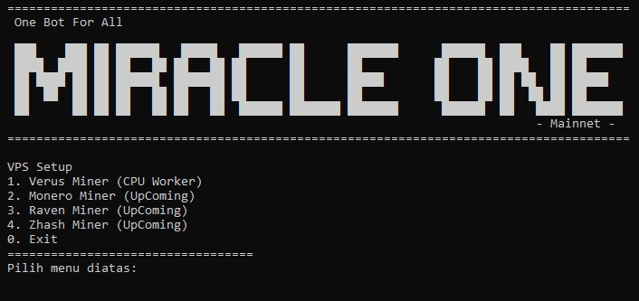

# MiracleOne
🌍 Satu Bot untuk Semua Koin 🚀  

MiracleOne adalah bot open-source yang kami bagikan gratis di GitHub. Bot ini dirancang untuk melakukan mining berbagai macam koin dan token mainnet hanya dengan satu bot, sehingga memudahkan pengguna tanpa perlu repot menggunakan banyak software. 

## Keuntungan
- Sangat Ringan
- Sangat Mudah
- Banyak Jenis Blockchain
- Setting Jumlah core/thread yang digunakan

### Versi
MiracleOne - Mainnet  
[Linux](https://github.com/miracleairdrop)  
  
MiracleOne - Testnet (ComingSoon)  
[Linux](https://github.com/miracleairdrop) | [Windows](https://github.com/miracleairdrop)


## Linux
#### 1. Download & Install
```bash
git clone https://github.com/miracleairdrop/MiracleOne.git
cd MiracleOne
```
#### 2. Jalankan MiracleOne:
```bash
./MiracleOne
```

  
Selesai, kalian tinggal ikuti instruksi yang ada di terminal kalian !!  
Semua lengkap dengan panduan dalam skrip berbahasa indonesia, Happy Mining !!!

<br><br><br>
🔥 Mohon dukungan agar Miracle Airdrop semakin berkembang, like dan gabung ke channel kami, sebarkan dan undang teman anda, Terima kasih !
## 🌐 Komunitas Miracle Airdrop
Gabung dan ikuti info terbaru:
- 💬 [Telegram](https://t.me/miracleairdrops)
- 🎮 [Facebook](https://facebook.com/miracleairdrop)
- 🐦 [X / Twitter](https://x.com/miracle_forum)
- ▶️ [Youtube](https://www.youtube.com/@miracle_airdrop)
- 🐙 [Github](https://github.com/miracleairdrop)
